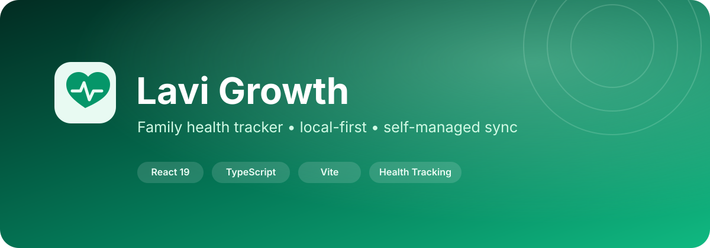

<div align="center">
  

  # Lavi Growth

  **Family health tracker yang local-first, responsif, dan dapat disinkronkan ke backend milik sendiri.**

  [](CHANGELOG.md)
  [](../../actions/workflows/ci.yml)
  [](LICENSE)
  [](https://www.typescriptlang.org/)
  [](https://react.dev/)
</div>

## Tentang

Lavi Growth adalah aplikasi web untuk membantu pencatatan kesehatan keluarga dalam satu antarmuka. Aplikasi mendukung profil bayi, anak, dewasa, lansia, dan kehamilan; pencatatan metrik kesehatan; pengingat; jurnal; galeri; statistik; data menstruasi; serta backup dan sinkronisasi opsional.

Aplikasi dirancang **local-first**: data utama disimpan di IndexedDB browser dan tetap dapat digunakan tanpa akun. Sinkronisasi cloud bersifat opsional dan dikendalikan oleh konfigurasi backend pengguna.

> **Penting:** Lavi Growth bukan alat diagnosis dan bukan pengganti konsultasi dokter, bidan, apoteker, atau tenaga kesehatan profesional.

## Fitur utama

- Multi-profile keluarga: bayi, anak, dewasa, lansia, dan kehamilan.
- Catatan berat, tinggi, suhu, denyut jantung, tekanan darah, gula darah, lingkar tubuh, tidur, gejala, catatan, serta foto.
- Statistik, target kesehatan, galeri, jurnal, pengingat, imunisasi, milestone tumbuh-kembang, dan siklus menstruasi.
- Daily briefing dan notifikasi browser melalui service worker.
- Reminder berulang maupun tanggal tertentu.
- Export/import backup JSON terversi, export Excel, dan PDF.
- Mode gelap, tampilan mobile, PWA offline cache, dan queue sinkronisasi tahan gagal.
- Backend Google Apps Script/Spreadsheet yang dapat dikonfigurasi sendiri.
- Integrasi Supabase melalui RPC terproteksi, PIN ter-hash, rate limit, dan tanpa akses tabel langsung untuk role browser.
- Referensi eksternal non-diagnostik melalui Open Food Facts, OpenStreetMap/Nominatim, OpenFDA, dan Wikipedia.

## Stack

| Area | Teknologi |
| --- | --- |
| Frontend | React 19, TypeScript, Vite |
| UI | Tailwind CSS CDN, Framer Motion, Lucide React |
| Chart | Recharts |
| Export | jsPDF, jsPDF-AutoTable, html2canvas |
| Backend opsional | Google Apps Script / Supabase |
| Storage lokal | IndexedDB + Web Storage untuk konfigurasi ringan |
| PWA | Service Worker + Web App Manifest |

## Menjalankan lokal

### Prasyarat

- Node.js 22+ **atau** Bun terbaru.
- Browser modern berbasis Chromium, Firefox, atau Safari.

### Bun

```bash
bun install
bun run dev
```

### npm

```bash
npm install
npm run dev
```

Buka URL lokal yang ditampilkan Vite.

## Pemeriksaan sebelum build

```bash
bun run check
```

Perintah tersebut menjalankan TypeScript type-check lalu production build. CI menjalankan pemeriksaan yang sama untuk push dan pull request.

## Build produksi

```bash
bun run build
```

Output produksi berada di folder `dist/`.

Panduan deployment tersedia di [docs/DEPLOYMENT.md](docs/DEPLOYMENT.md).

## Struktur repository

```text
.
├── .github/                 # CI, release automation, issue/PR templates, Dependabot
├── assets/                  # Banner dan aset dokumentasi
├── components/              # Komponen UI dan fitur
├── data/                    # Data referensi aplikasi
├── docs/                    # Panduan pengguna, arsitektur, deployment, keamanan backend
├── public/                  # Favicon, manifest, robots, service worker
├── services/                # Adapter backend, IndexedDB, external API
├── App.tsx                  # Orkestrasi aplikasi
├── ScriptGAS.gs             # Backend Google Apps Script
├── index.html               # Entry HTML
├── index.tsx                # React bootstrap + state hydration + PWA registration
├── types.ts                 # Type definitions
├── utils.ts                 # Utility, backup, dan state persistence
└── package.json             # Scripts, dependency, version
```

## Konfigurasi database

Lavi Growth dapat berjalan secara lokal tanpa backend. Untuk sinkronisasi lintas perangkat, gunakan backend milik sendiri dan baca [docs/DATABASES.md](docs/DATABASES.md) terlebih dahulu.

**Jangan menaruh secret, service-role key, password, token, PIN nyata, atau kredensial pribadi ke repository.** Supabase hanya membutuhkan anon/public key di frontend; data tetap dilindungi melalui fungsi RPC server-side dan tabel tidak diberikan akses langsung kepada role browser.

## Privasi & keamanan

Data kesehatan dapat bersifat sangat sensitif. Sebelum menggunakan aplikasi dengan data nyata:

1. lindungi perangkat, browser, dan akun OS;
2. ganti PIN awal dan gunakan PIN 6-12 digit;
3. backup secara berkala;
4. gunakan schema Supabase v1.0.1 terbaru atau GAS backend v9.0 terbaru;
5. tinjau [SECURITY.md](SECURITY.md) dan [docs/PRIVACY.md](docs/PRIVACY.md).

## Dokumentasi

- [Panduan pengguna](docs/USER_GUIDE.md)
- [Arsitektur](docs/ARCHITECTURE.md)
- [Deployment](docs/DEPLOYMENT.md)
- [Database & sinkronisasi](docs/DATABASES.md)
- [Privasi](docs/PRIVACY.md)
- [Security policy](SECURITY.md)
- [Panduan kontribusi](CONTRIBUTING.md)
- [Changelog](CHANGELOG.md)

## Lisensi

Project ini menggunakan **BASKA-PRO Personal Use License v1.0**. Lihat [LICENSE](LICENSE) untuk ketentuan lengkap.

Copyright © 2026 Lathif Baska. All Rights Reserved.
